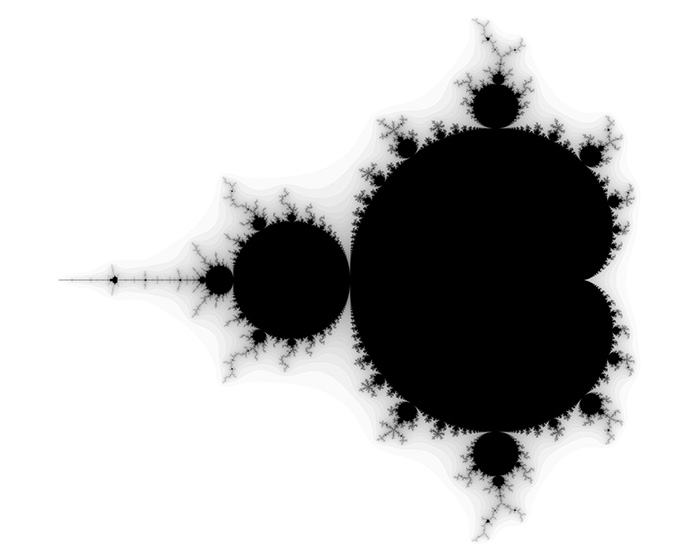

Get Started in ReStructuredText
===============================

Here we will see how we can make a Mandelbrot set plot with Python code.

.. important::
    
   This exercise focuses on intermediate level Python users who feel comfortable using NumPy and complex numbers.

MandelBrot set rst
------------------

The Mandelbrot set is a beautiful fractal and is defined as the set of complex numbers :math:`c` for which the sequence :math:`z_{n+1} = z_n^2 + c` does not diverge when iterated from :math:`z=0`, i.e., for which the sequence :math:`|z_n|` remains bounded in value.

Full code rst
----------------

.. literalinclude:: ../src/mandelbrot.py
   :language: python

Code Explanation rst
--------------------

Hyperlink test:

Please see :func:`src.mandelbrot.mandelbrot`.
Please see :func:`mandelbrot.mandelbrot`.
Please see :func:`mandelbrot`.

Autofunction test:

.. autofunction:: src.mandelbrot.mandelbrot
   :noindex:

.. autofunction:: mandelbrot.mandelbrot
   :noindex:

.. autofunction:: mandelbrot
   :noindex: